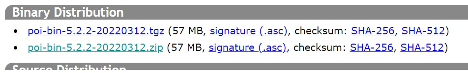
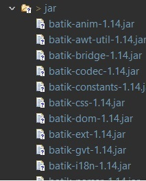
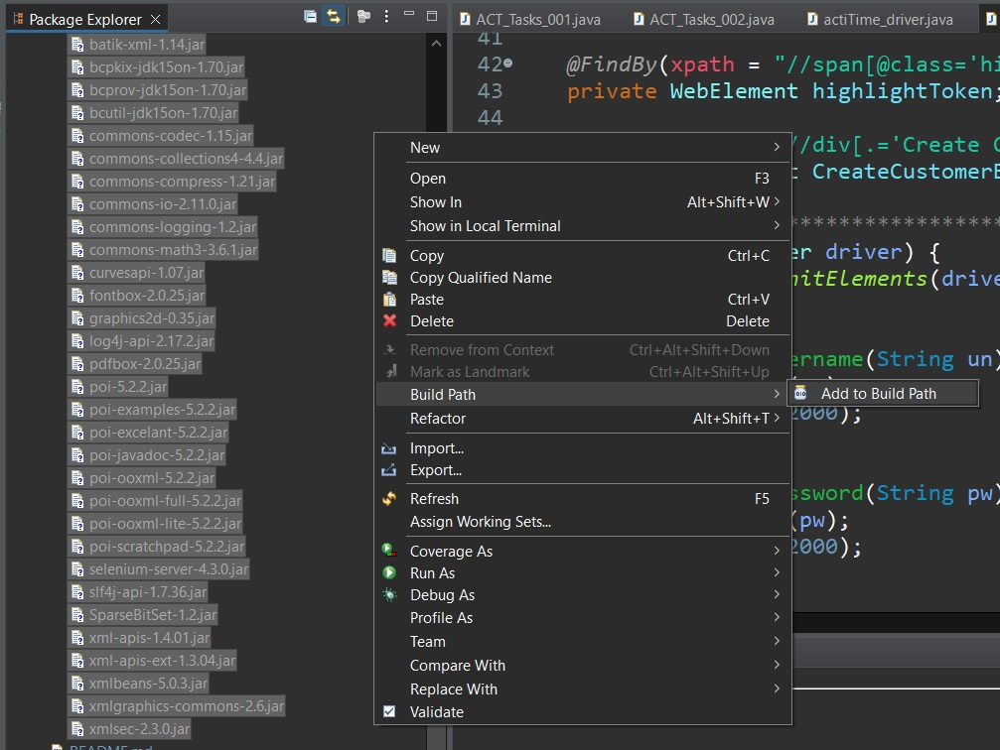
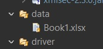
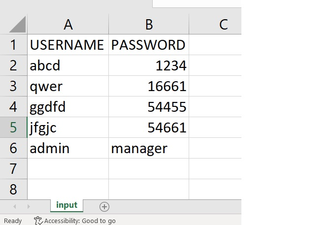
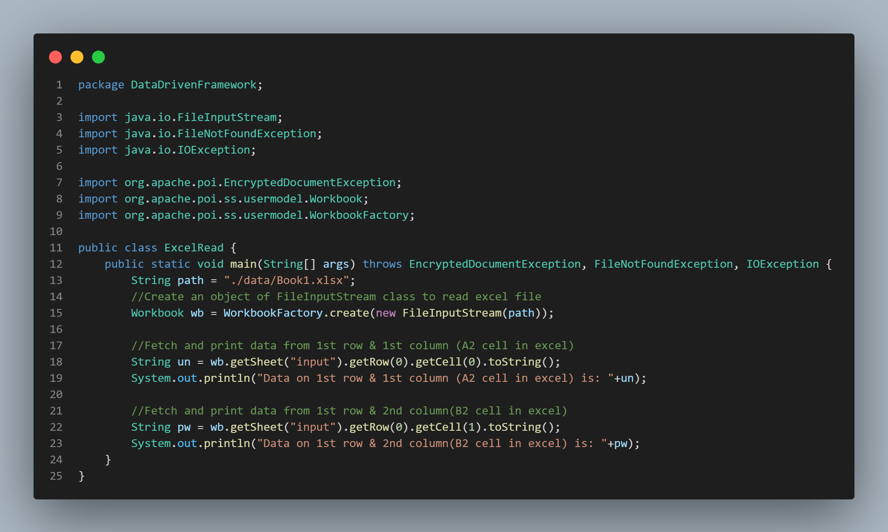
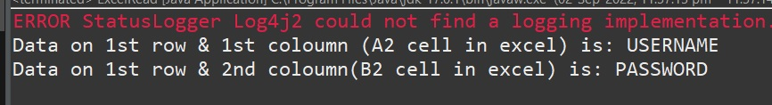
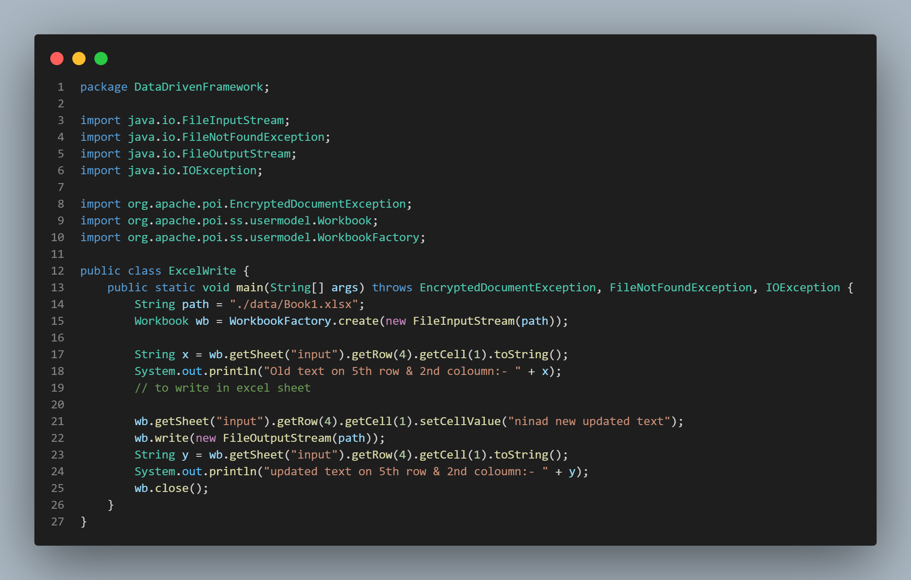
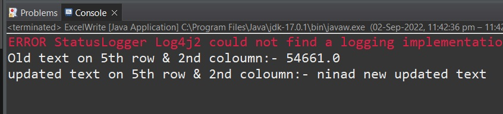

# Selenium
Selenium Qspiders on eclipse with JAVA

1.  [DataDrivenFramework](#DataDrivenFramework)
    1. [DownloadSteps](#to-download-poi-follow-this-steps)
    2. [ExcelRead](#excelread)
    3. [ExcelWrite](#excelwrite)
1.  [Page Object Model(POM)](#page-object-modelpom)
1.  [TestNG](#testng)

## DataDrivenFramework

1. While writing selenium scripts ,we should not hardcode all inputs.
2. Insted we need to fetch input from extended file such as **excel** file.
3. To fetch data from excel file and use it in java we need an **api(application programming interface)** known as **POI(Poor Obfuscation/abstraction Implementation)** 

***********************************

## To download POI follow this steps:-
1. Go to Google and type POI jar file download and select first link.
    ```
        https://poi.apache.org/download.html
    ```
2. Under Binary distribution click on **`.zip`** link.



3. Click on suggested link for download. The zip file gets downloaded automatically.


4. Extract the zip file.

5. Copy paste all jar file from folders and subfolders into jar folder of eclipse.



6. Select all .jar files -> Right click -> Go to build path -> Click on add to build path.



7. Create folder called `data` in java project and copy-paste excel sheet.



8. Type **USERNAME** and **PASSWORD** in excel sheet and give sheet name as `input`.



*******************************
## ExcelRead
- **Scenario**
    1. Open Book1.xlsx file.
    2. Fetch and print data from 1st row & 1st column **`(A2 cell in excel)`**
    3. Fetch and print data from 1st row & 2nd column **`(B2 cell in excel)`**
    
- **Code**



- **OUTPUT**


*******************************

## ExcelWrite
- **Scenario**
    1. Open Book1.xlsx file.
    2. Print old value on 5th row and 2nd column **`(B5 cell in Excel)`**.
    3. Change value of 5th row and 2nd column **`(B5 cell in Excel)`**.
    4. Print new updated value on 5th row and 2nd column **`(B5 cell in Excel)`**. 

- **Code**



- **OUTPUT**



******************************************************************************

# Page Object Model(POM)

******************************************************************************

# TestNG


**************************
[GoBackToMainFile](https://github.com/NinadKarlekar/Selenium/blob/4316f057532f7bd3089d4e841319c5ce03f9b83d/README.md)


