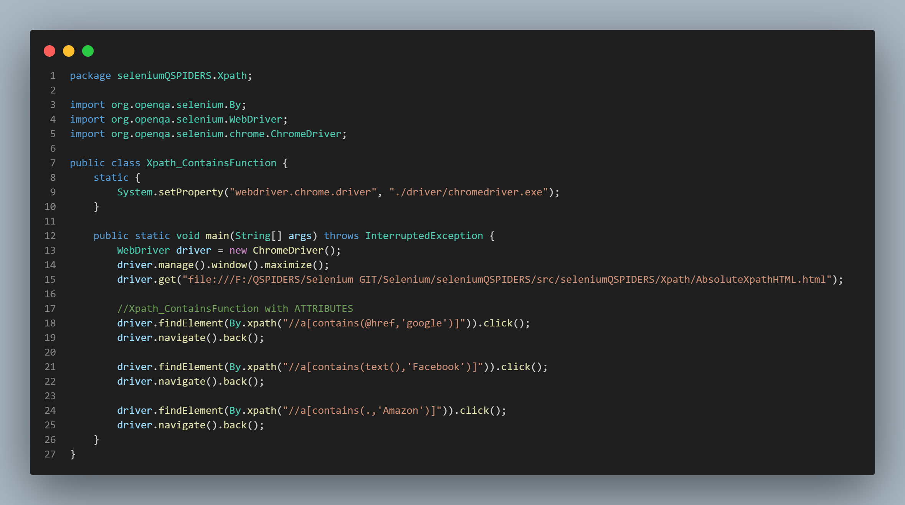
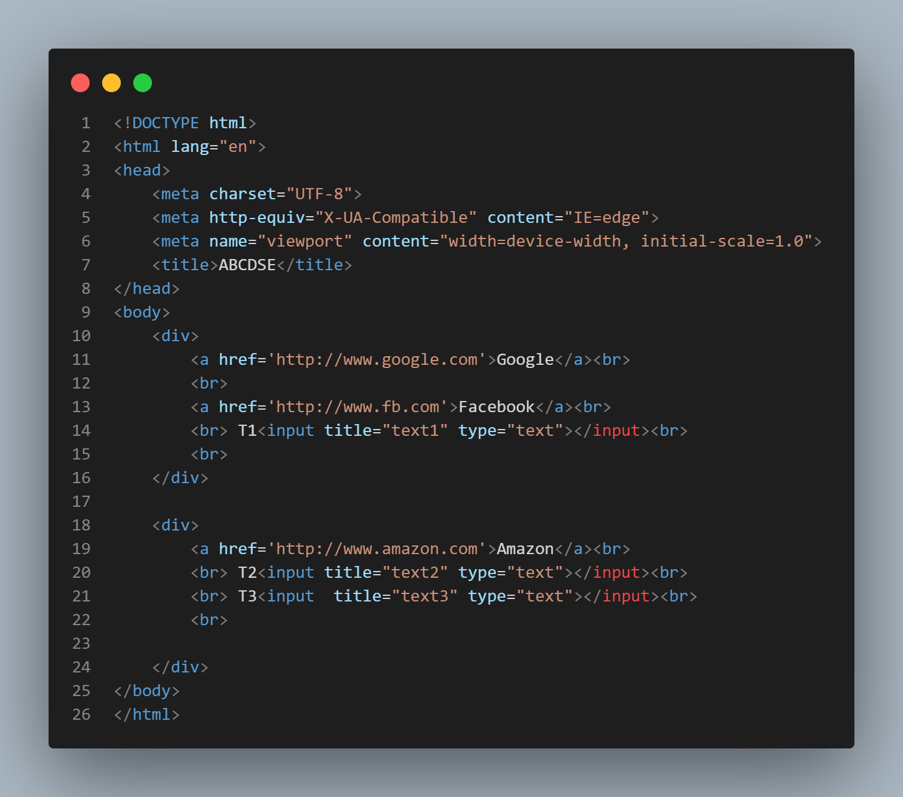
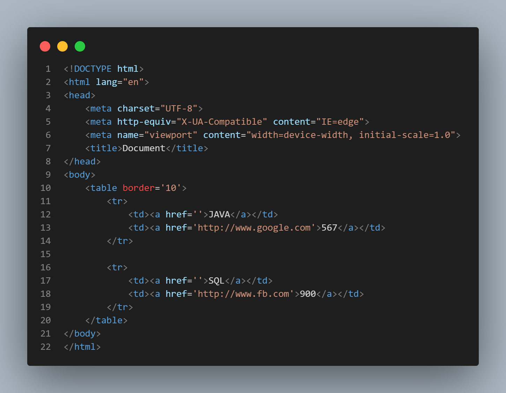
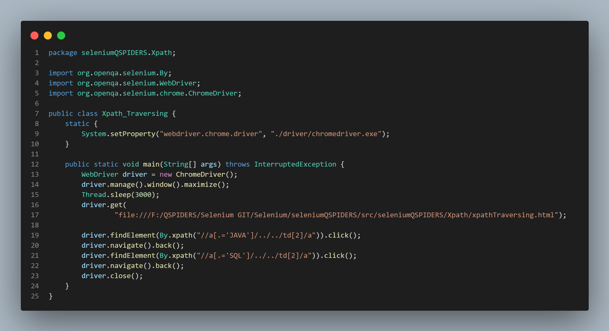
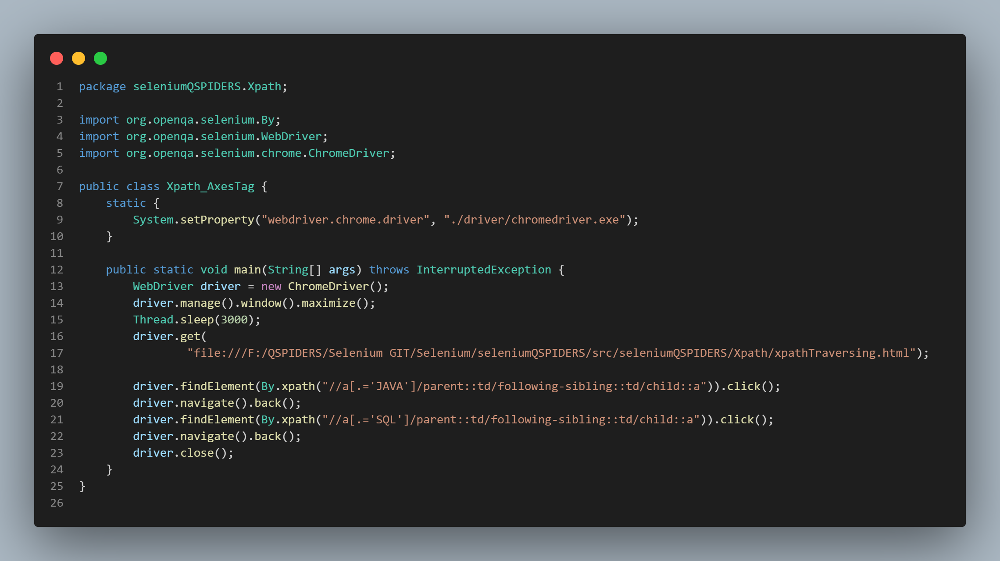

# Selenium
Selenium Qspiders on eclipse with JAVA


- The **WebDriver** interface is child of **SerchContext** interface. It has 13 methods as follows:-
    1.  [get()](#get)
    2.  [getTitle()](#getTitle)
    3.  [getCurrentUrl()](#getCurrentUrl)
    4.  [getPageSource()](#getPageSource)
    5.  [manage()](#manage)
    6.  [switchTo()](#switchTo)
    7.  [navigate()](#navigate)
    8.  [close()](#close)
    9.  [quit()](#quit)
    10.  [getWindowHandle](#getWindowHandle)
    11.  [getWindowHandles](#getWindowHandles)
    12. [findElement](#findElement)
    13. [findElements](#findElements)

**************************
- The **JavaScriptExecutor** interface contains 2 methods as follows:-
    1. [executeScript()](#executeScript)
    2. [executeAsyncScript()](#executeAsyncScript)

***************************
- The **TakesScreenshot** interface has 1 method:-
    1. [getScreenshotAs()](#getScreenshotAs)

****************************

## get
- It is used to enter url
- It also waits till first page is completly loaded
- Syntax:-
```java
    driver.get("url");
```
*********************************

## getTitle
- It is used to fetch title of page
- Syntax:-
```java
    String title = driver.getTitle(); //getTitle()
    System.out.println("\nTitle of Page is:- "+title);
```
*********************************

## getCurrentUrl
- It is used to fetch url of current page
- Syntax:-
```java
    String url = driver.getCurrentUrl(); //getCurrentUrl()
    System.out.println("\nurl of Page is:-"+ url);
```
*********************************

## getPageSource
- It is used to fetch html code of current page
- Syntax:-
```java
    String page = driver.getPageSource(); //getPageSource()
    System.out.println("\nSource code of Page is:- "+page);
```

**************************************

## manage
- This method is used to maximize or minimize window
- Syntax:-
```java
    driver.manage().window().maximize();  //manage()
    driver.manage().window().minimize();
```
*********************************
## close
- The close() method is a Webdriver command that closes the browser window **currently in focus**.
- Syntax:-
```java
    driver.close();
```

*********************************
## quit
- The quit() command quits the entire browser session with **all its tabs and windows.**.
- Syntax:-
```java
    driver.quit();
```

*********************************

## get() , getTitle() , getCurrentUrl() , getPageSource() , manage() **CODE AND OUTPUT**


*********************************


## switchTo
- switchTo() method is used to type text in active element.
- Any element where cursor is blinking is called Active element.
- Syntax:-

*********************************

## navigate
- Navigation commands are those commands in Selenium that are used to perform different operations such as backward, forward, refresh, wait, etc in the browser’s history.
- It has 3 types

    1. **Navigate forward:** This method is used to move forward by one page on the browser’s history.
        * Syntax:
    ```java
    driver.navigate().forward();
    ```
    2. **Navigate Back :**  This method is used to move back by one page on the browser’s history. 
        * Syntax:
    ```java
    driver.navigate().back();
    ```
    3. **To Command:**  This method is used to navigate the URL of the web page in the current browser window. It will just navigate to the web page but not wait till the whole page gets loaded.
        * Syntax: 
    ```java
    driver.navigate().to(URL);
    ```
    4. **To refresh:** This method is used to refresh the current web page.
        * Syntax:
    ```java
    driver.navigate().refresh();
    ```

*********************************

## getWindowHandles

- get.windowhandle(): helps in getting the window handle of the current window
- get.windowhandles(): helps in getting the handles of all the windows opened
- set: helps to set the window handles which is in the form of a string.```set<string> set= driver.get.windowhandles()```


*********************************
## findElement
- A command used to uniquely identify a web element within the web page.
- Returns the first matching web element if multiple web elements are discovered by the locator
- Throws NoSuchElementException if the element is not found
- Detects a unique web element


## findElements
- A command used to identify a list of web elements within the web page.
- Returns a list of multiple matching web elements
- Returns an empty list if no matching element is found
- Returns a collection of matching elements
- findElement() and findElements() have 8 locators
- Syntax for findElements()
```java
    List<WebElement> elementName = driver.findElements(By.LocatorStrategy("LocatorValue"));
```
- Example
```java
    List<WebElement> listOfElements = driver.findElements(By.xpath("//div"));
```
## **Locators**
1.  [id()](#id)
2.  [name()](#name)
3.  [className()](#className)
4.  [tagName()](#tagName)
5.  [linkText()](#linkText)
6.  [partialLinkText()](#partialLinkText)
7.  [cssSelector()](#cssSelector)
8.  [xpath()](#xpath)

### id
- ID is uniquely defined for each element 
- driver will locate an element by "id" attribute
- Syntax:-
```java
    driver.findElement(By.id(" "));
```
- Example
```java
    WebElement loginTB = driver.findElement(By.id("email"));
```
- Where `email` is **'id'**.
******************************************************
### name
- driver will locate an element by "name" attribute.
- Syntax:-
```java
    driver.findElement(By.name(" "));
```
- Example
```java
    driver.findElement(By.name("login"));
```
- Where `login` is **'name'**.
******************************************************
### className
- Syntax:-
```java
    driver.findElement(By.className(" "));
```
- Example
```java
    driver.findElement(By.className("inputtext _55r1 _6luy"));	
```
- Where `inputtext _55r1 _6luy` is **'ClassName'**.
******************************************************
### tagName
- Syntax:-
```java
    driver.findElement(By.tagName(" "));
```
- Example
```java
    WebElement loginBtn = driver.findElement(By.name("login"));
```
- Where `login` is **'name'**.
******************************************************
### linkText
- LinkText is helpful to find links in a webpage. It is the most efficient way of finding web elements containing links.
- Syntax:-
```java
    driver.findElement(By.linkText(" "));
```
- Example
```java
    WebElement loginBtn = driver.findElement(By.name("login"));
```
******************************************************
### partialLinkText
- Syntax:-
```java
    driver.findElement(By.partialLinkText(" "));
```
- Example
```java
    WebElement loginBtn = driver.findElement(By.name("login"));
```
******************************************************
### cssSelector
- CSS Selectors are one of the locator strategies offered by Selenium to identify the web elements. 
- The CSS Selectors mainly use the character sequence pattern, which identifies the web elements based on their HTML structure.
- Syntax:-
```java
    tag[Attribute_Name = 'Attribute_value']
```
- CSS Selectors can be created based on the following ways:
    1.  [id_attribute](#idAttribute)
    2.  [class_attribute](#classAttribute)
    3.  [OtherAttribute](#OtherAttribute)
    4.  [CombiningAttribute](#CombiningAttribute)

#### idAttribute
- Syntax
```java
    tag[id = 'id_value']
```
- Example:-
```java
    //For password TextField in facebook login page
    driver.findElement(By.cssSelector("input[id='pass']"));
                        //OR
    driver.findElement(By.cssSelector("input#pass"));
```
- Where `pass` is **'id'**.
- The `'#'`sign symbolizes the **'ID'** in CSS Selector.

**********************************
#### classAttribute
- Syntax
```java
    tag[class = 'class_value']
```
- Example:-
```java
    //For password TextField in facebook login page
    driver.findElement(By.cssSelector("input[class='inputtext _55r1 _6luy _9npi']"));
                        //OR
    driver.findElement(By.cssSelector("input.inputtext _55r1 _6luy _9npi"));
```
- Where `inputtext _55r1 _6luy _9npi` is **'className'**.
- The `.`dot sign symbolizes the **'class'** in CSS Selector.
************************************
#### OtherAttribute
- Apart from the id and class attributes, all other attributes present within the HTML tag of the element can also be used to locate web elements using the CSS Selectors.
- Syntax:-
```java
    tag[Attribute_Name = 'Attribute_value']
```
- Example
```java
    WebElement loginTB = driver.findElement(By.cssSelector("input[type='text']"));
	loginTB.sendKeys("bamlutuyde@vusra.com");
```
- Where `input` is `tag`.
- `type` is `Attribute_Name`.
- `text` is `Attribute_value`.
******************************************************
#### CombiningAttribute
- we combine multiple attributes to precisely locate any element present on the web page.

    1. Combine the **ID** and **other Attributes**
        - Syntax:-
            ```java
                tag#ID_Value[Other_AttributeName='Other_AttributeValue']
            ```
        - Example
            ```java
                input#pass[placeholder='Password']
            ```
        - where
            - `input` is **'tagName'**
            - `pass` is **'ID_Value'**
            - `placeholder` is **'Other Attribute Name'**
            - `Password` is **'Other Attribute Value'**
        ```java
            driver.findElement(By.cssSelector("input#pass[placeholder='Password']"));
        ```


    2. Combine the **Class** and **other Attributes**
        - Syntax:-
            ```java
                tag.Class_Value[Other_AttributeName='Other_AttributeValue']
            ```
        - Example
            ```java
                input.inputtext _55r1 _6luy _9npi[placeholder='Password']
            ```
        - where
            - `input` is **'tagName'**
            - `inputtext _55r1 _6luy _9npi` is **'class_Value'**
            - `placeholder` is **'Other Attribute Name'**
            - `Password` is **'Other Attribute Value'**   
        ```java
            driver.findElement(By.cssSelector("input.inputtext _55r1 _6luy _9npi[placeholder='Password']"));
        ```

**************************************************
## xpath

Xpath are of 2 types:-
1.  [AbsoluteXpath](#AbsoluteXpath)
2.  [RelativeXpath](#RelativeXpath)
    1.  [Xpath_by_Attribute](#Xpath_by_Attribute)
    2.  [Xpath_by_TextFunction](#Xpath_by_TextFunction)
    3.  [Xpath_by_ContainsFunction](#Xpath_by_ContainsFunction)
    4.  [Xpath_by_Dependant_Independant](#Xpath_by_Dependant_Independant)
    5.  [Xpath_by_Group_Index](#Xpath_by_Group_Index)
    6.  [Xpath_by_AxesTag](#Xpath_by_AxesTag)


## AbsoluteXpath
- In AbsoluteXpath syntax starts from `.`
- We use `.` for current html program / directory.
- We use `/` for child element.
- We use `/..` for parent element.
- We use `//` for desendnt element(child, grand-child, great-grand-child).
- We use `[]` to specify index value.In html index value starts from *1*.
- eg. 
```java
	WebElement a1 = driver.findElement(By.xpath("./html/body/div[1]/a[1]"));
	a1.click();
```
*********************************************************************

## RelativeXpath
- Relative Xpath starts with `//` .
- We use `//` for desendnt element(child, grand-child, great f=grand-child).
- eg. 
```java
    //For link 1 GOOGLE
	driver.findElement(By.xpath("//div[1]/a[1]")).click();
```

*******************************


- link.html file


Element | Absolute Xpath | Relative Xpath
--- | --- | ---
*Google* | `./html/body/div[1]/a[1]` | `//div[1]/a[1]`
*T3* | `./html/body/div[2]/input[2]` | `//input[2]`
*Google , FB* | `./html/body/div[1]/a` | `//div[1]/a`
*Google ,Amazon* | `./html/body/div/a[1]` | `//a[1]`
*T1 ,T2 ,T3* | `./html/body/div/input` | `//input`
*T1 ,T2* | `./html/body/div/input[1]` | `//input[1]`
*Google ,FB ,Amazon* | `./html/body/div/a` | `//a`

********************************************************
**There are several types of Relative Xpath**
1.  [Xpath_by_Attribute](#Xpath_by_Attribute)
2.  [Xpath_by_TextFunction](#Xpath_by_TextFunction)
3.  [Xpath_by_ContainsFunction](#Xpath_by_ContainsFunction)
4.  [Xpath_by_Dependant_Independant](#Xpath_by_Dependant_Independant)
5.  [Xpath_by_Group_Index](#Xpath_by_Group_Index)
6.  [Xpath_by_AxesTag](#Xpath_by_AxesTag)

***********************************************
### Xpath_by_Attribute
- XPath expression select nodes or list of nodes on the basis of attributes like ID , Name, Classname, etc.
- Syntax:-
```
    //tag[@AttributeName='AttributeValue']
```
- Example:-
```java
    //To find Login TextBox in Facebook login page.
	driver.findElement(By.xpath("//input[@type='text']")).sendKeys("bamlutuyde@vusra.com");
```
**************************************************************************

### Xpath_by_TextFunction
- Syntax:-
```
    //tag[.='text Value']
            **OR**
    //tag[text()='text Value']
            **OR**
    //*[text()='text Value']
```
- Example:-
```java
    //To find password TextBox in Facebook login page.
	driver.findElement(By.xpath("//span[.='Log Out']")).click();
                    //OR
	driver.findElement(By.xpath("//span[text()='Log Out']")).click();
                    //OR
	driver.findElement(By.xpath("//*[text()='Log Out']")).click();
```
**************************************************************************

### Xpath_by_ContainsFunction
- The contain feature has an ability to find the element with partial text.
- Contains Method has 2 types:-
    ##### 1. Attributes
    - Syntax:-
    ```
        //tag[contains(@AttributeName,'Partial Attribute Value')]
    ```
    - Example:-
    ```java
    	driver.findElement(By.xpath("//a[contains(@href,'google')]")).click();
    ```

    ##### 2. Text
    - Syntax:-
    ```
        //tag[contains(text(),'Partial Text Value')]

                        **OR**

        //tag[contains(.,'Partial Text Value')]
    ```
    - Example:-
    ```java
        driver.findElement(By.xpath("//a[contains(text(),'Facebook')]")).click();

        driver.findElement(By.xpath("//a[contains(.,'Amazon')]")).click();
    ```



*****************************************************

### Xpath_by_Dependant_Independant
- It is also called as **Xpath Traversing**.
- In this type of Xpath there are elements which changes with respect to time.
- Steps:-
    1. Write xpath for independant element.
    2. Trverse towards dependant element.
- In AbsoluteXpath syntax starts from `.`
- We use `.` for current html program / directory.
- We use `/` for child element.
- We use `/..` for parent element.
- We use `//` for desendnt element(child, grand-child, great-grand-child).
- We use `[]` to specify index value.In html index value starts from *1*.
- Example
```java
    driver.findElement(By.xpath("//a[.='JAVA']/../../td[2]/a")).click();
```





************************************************

### Xpath_by_Group_Index
- In this type of xpath, we specify the xpath within **common brackets** `()`.
- By doing this an xpath array is generated starting with index `1`.
- Unique indexes are given for every matching element.
- At end of xpath we specify the index value within **Square Brackets** `[]`.
- Syntax:-
```
    (//tagName)[IndexValue];
```
- Example:-
```java
    driver.findElement(By.xpath("(//a)[1]")).click(); //For Link 1 a[1] Google
```


******************************************************

### Xpath_by_AxesTag
- Different XPath Axes Used In Selenium Testing:-
    1. **child:-** This indicates the children of the context node
        - Syntax:-
        ```
            /child::tagName
        ```

    2. **parent:-** This indicates the parent of the context node
        - Syntax:-
        ```
            /parent::tagName
        ```

    3. **descendent:-** This indicates the children, grandchildren, and their children (if any) of the context node.
        - Syntax:-
        ```
            /descendant::tagName
        ```

    4. **following-sibling:-** This one indicates all the sibling nodes (same parent as the context node) that appear after the context node .
        - Syntax:-
        ```
            /following-sibling::tagName
        ```

    5. **preceding-sibling:-** This one indicates all the sibling nodes (same parent as context node) that appear before the context node
        - Syntax:-
        ```
            /preceding-sibling::tagName
        ```

- Example for Axes Tag
```java
    driver.findElement(By.xpath("//a[.='JAVA']/parent::td/following-sibling::td/child::a")).click();
```





******************************************************************************

[GoBackToMainFile](https://github.com/NinadKarlekar/Selenium/blob/4316f057532f7bd3089d4e841319c5ce03f9b83d/README.md)


***************************************************************
## link_access_with_findElement_by_linktext


 
***************************************************************


## xpath1
Xpath is having 2 types:-
1. Absolute Xpath
2. Relative Xpath

### AbsoluteXpath


### RelativeXpath


***************************************************************
