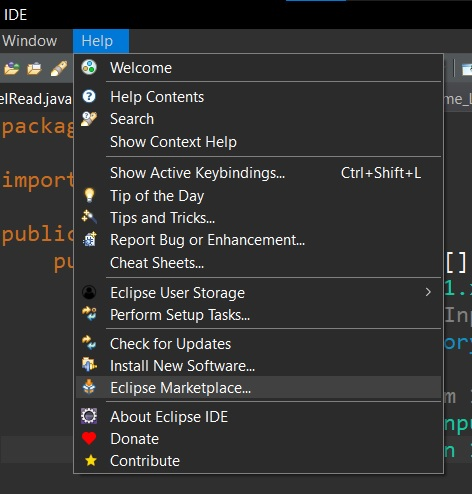
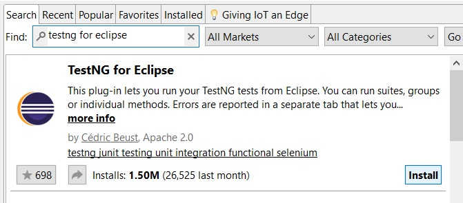
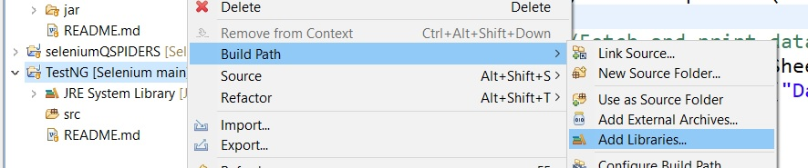
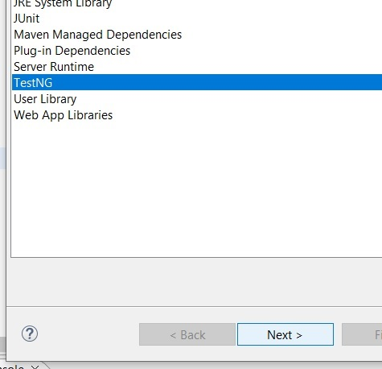
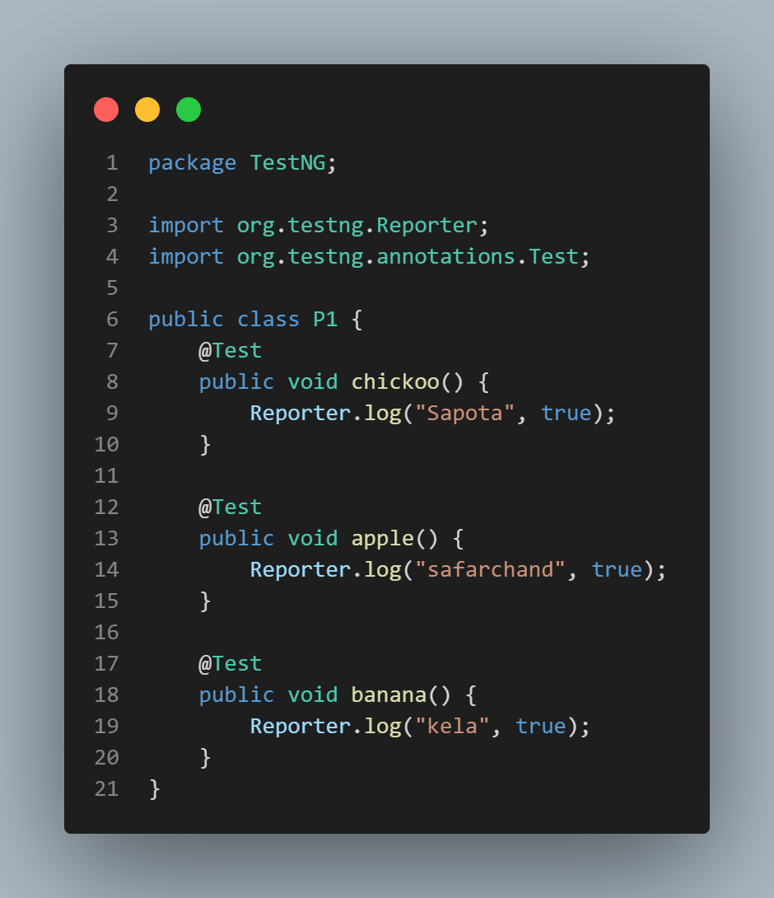
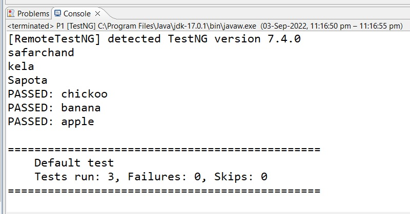
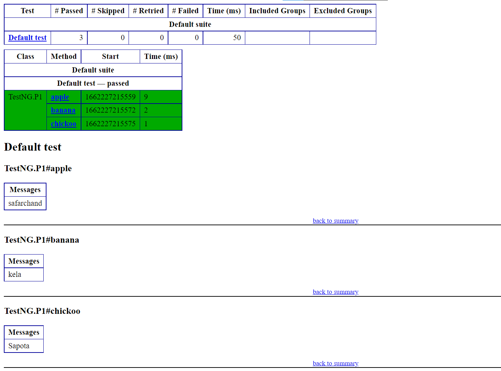

# TestNG


1.  [TestNG](#TestNG)
2.  [TestNG_Installation](#TestNG_Installation)
3.  [TestNG_Configuration](#TestNG_Configuration)

***********************

## TestNG_Installation
Steps:-
1. Open Eclipse and create java project
2. Go to Help -> Eclipse marketplace

    

3. Type **testNG for eclipse** in searchbox and install.

    

4. During Midway of installation we get a popup. Click on install anyway and after installing restart eclipse.

    

-----------------
**If this is not working try these steps:-**

1. click on Help menu -> Click on Install new software.

2. In popup click on add button. We get add repository popup.

3. Type TestNG in **name** textfield and paste following link in **location** textfield
    

```
https://testng.org/testng-eclipse-update-site
```


4. Select TestNG Checkbox and click on next and finish.

5. During Midway of installation we get a popup. Click on install anyway and after installing restart eclipse.

    


******************************

## TestNG_Configuration

1. Right click on java project -> build path -> add libraries

    

2. Select TestNG from popup click on next and finish.

    

3. By doing this the TestNG library is added into project.


***********************
## P1

- **Code:-**



- **Explanation:-**

    - 

- **Console**



- **Report.html**



*********************************