# TestNG
# Index

1.  [TestNG](#TestNG)
2.  [TestNG_Installation](#TestNG_Installation)
3.  [TestNG_Configuration](#TestNG_Configuration)

**********************

# Programs

1. [P1 (Alphabetical order)](#P1)
2. [P2 (Priority,invocationcount)](#P2)
3. [MouseHoverAction](#mousehoveraction)
4. [P3 (@BeforeMethod,@AfterMethod)](#P3)
5. [P5 (Google,Facebook)](#P5)
***********************

# Annotation in TestNG

1. [Annotation in TestNG](#Annotation_in_TestNG)
2. [Default Execution Order](#Default_Execution_Order)

************************
## TestNG_Installation
Steps:-
1. Open Eclipse and create java project
2. Go to Help -> Eclipse marketplace

    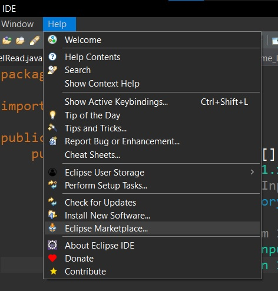

3. Type **testNG for eclipse** in searchbox and install.

    

4. During Midway of installation we get a popup. Click on install anyway and after installing restart eclipse.

    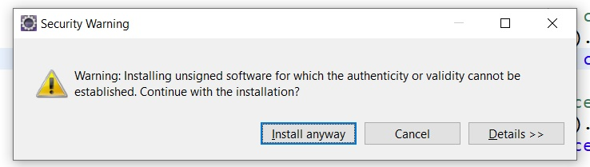

-----------------
**If this is not working try these steps:-**

1. click on Help menu -> Click on Install new software.

2. In popup click on add button. We get add repository popup.

3. Type TestNG in **name** textfield and paste following link in **location** textfield
    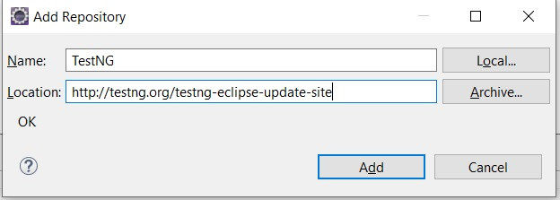

```
https://testng.org/testng-eclipse-update-site
```


4. Select TestNG Checkbox and click on next and finish.

5. During Midway of installation we get a popup. Click on install anyway and after installing restart eclipse.

    


******************************

## TestNG_Configuration

1. Right click on java project -> build path -> add libraries

    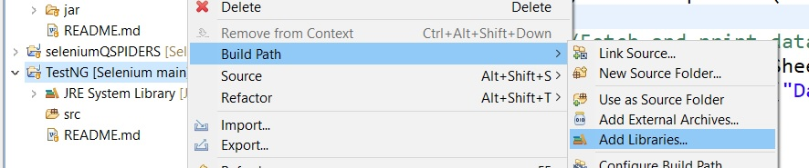

2. Select TestNG from popup click on next and finish.

    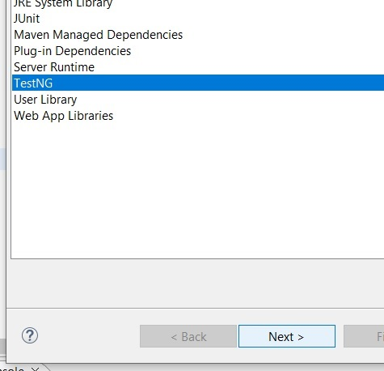

3. By doing this the TestNG library is added into project.


***********************
## P1

- **Code:-**

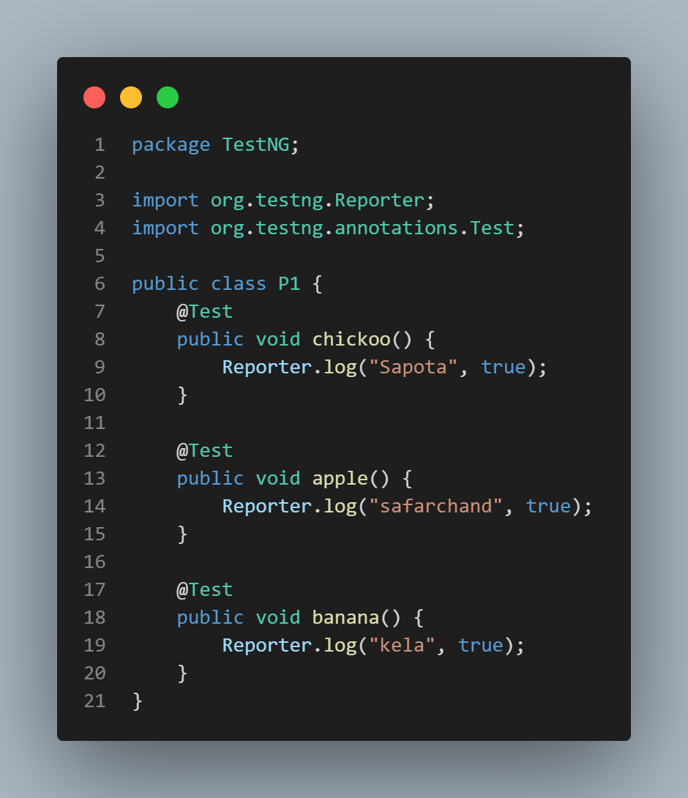

- **Explanation:-**

    - All methods will get executed in **alphabetical** order.

- **Console**

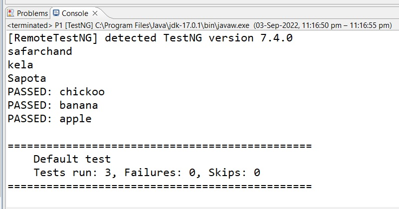

- **Report.html**

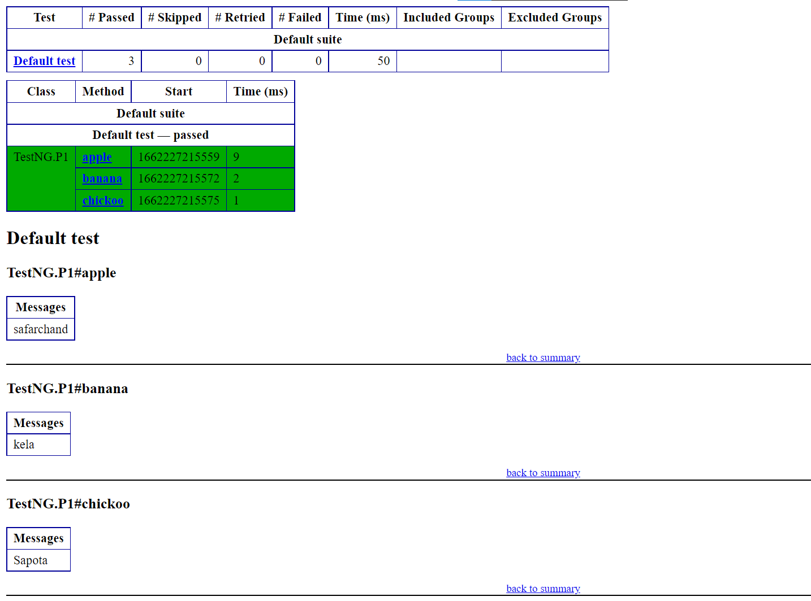

*********************************


## P2

- **Code:-**

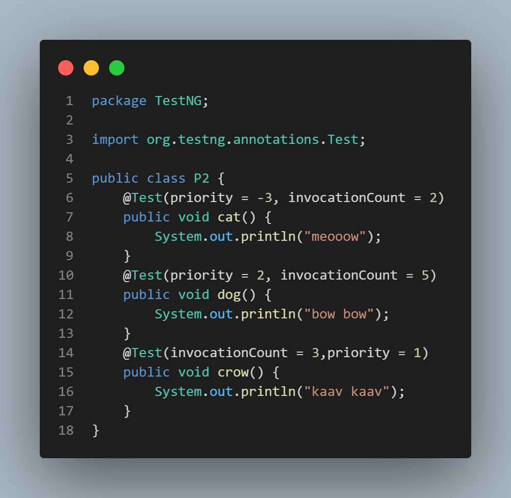

- **Explanation:-**

    - 

- **Console**


- **Report.html**


*********************************


## MouseHoverAction

- **Scenario**

    1. Open Browser and maximize it.
    2. Go to `https://www.vtiger.com/`
    3. Hover mouse on Resources -> and click on contact us.
    3. Print the phone number in console and report.
    4. Close browser.

- **Code:-**

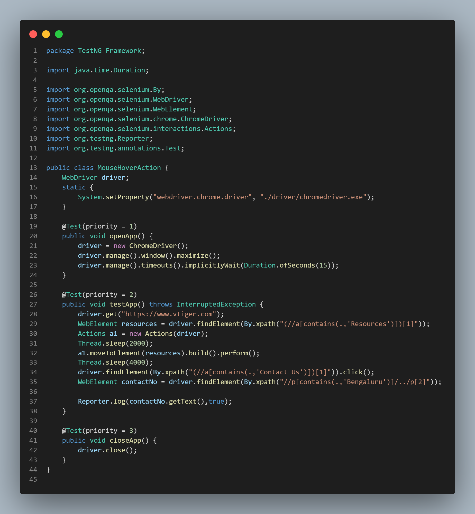


- **Report.html**

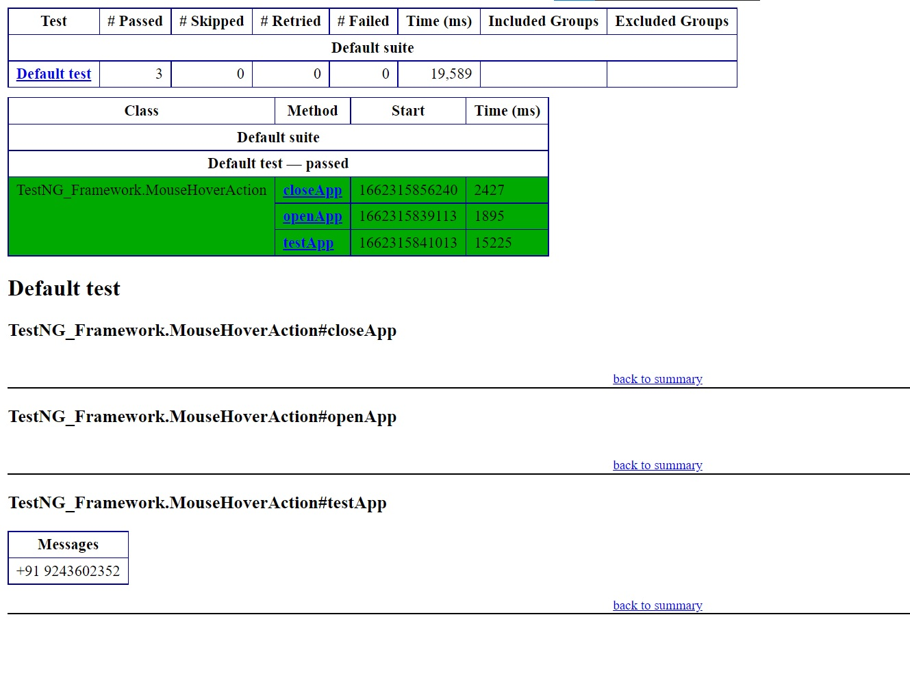

- **Explanation:-**

    - Declared driver variable in global area So that we can use it in all methods.

    ```java
        WebDriver driver;
    ```

    - Create a method called **openApp()** with @Test annotation and give **priority as 1**

    - Open browser -> Maximize window -> Give implicit wait of 15 seconds.

    ```java
        @Test(priority = 1)
        public void openApp() {
            driver = new ChromeDriver();
            driver.manage().window().maximize();
            driver.manage().timeouts().implicitlyWait(Duration.ofSeconds(15));
        }
    ```

    - Mandatory statements for Actions class:-
    ```java
        WebElement resources = driver.findElement(By.xpath("")); //xpath of hovering element 
        Actions a1 = new Actions(driver);
		Thread.sleep(2000);
		a1.moveToElement(resources).build().perform();
    ```

    - Reporter.log( , true) will print in **console** as well as in **report**
    ```java
        Reporter.log(contactNo.getText(),true);
    ```


*********************************************

# Annotation_in_TestNG

1. **BeforeSuite**
    - The **`@BeforeSuite`** annotated method will run before the execution of all the test methods in the suite.

2. **AfterSuite**
    -  The **`@AfterSuite`** annotated method will run after the execution of all the test methods in the suite.

3. **BeforeTest**
    - The **`@BeforeTest`** annotated method will be executed before the execution of all the test methods of available classes belonging to that folder.

4. **AfterTest**
    - The **`@AfterClass`** annotated method will be invoked after the execution of all the test methods of the current class.

5. **BeforeClass**
    - The **`@BeforeClass`** annotated method will be executed before the first method of the current class is invoked.


6. **AfterClass**
    - The **`@AfterClass`** annotated method will be invoked after the execution of all the test methods of the current class.


7. **BeforeMethod**
    - The **`@BeforeMethod`** annotated method will be executed **once** before each test method will run.

8. **AfterMethod**
    - The **`@AfterMethod `** annotated method will run **once** after the execution of each test method.

**************

# Default_Execution_Order

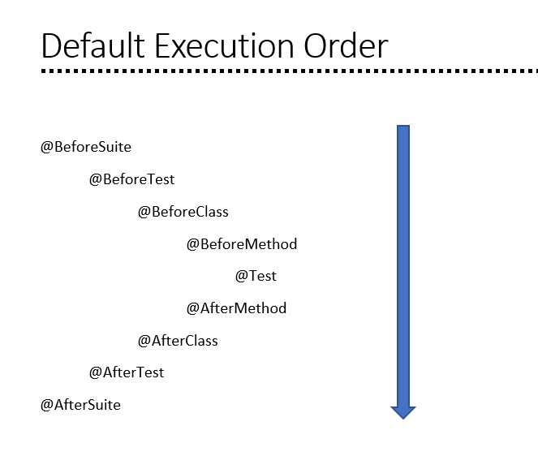

****************

# Steps_to_create_xml/suite_File

1. Right click on the project/package -> you will see **TestNG** -> **Convert to TestNG**.

    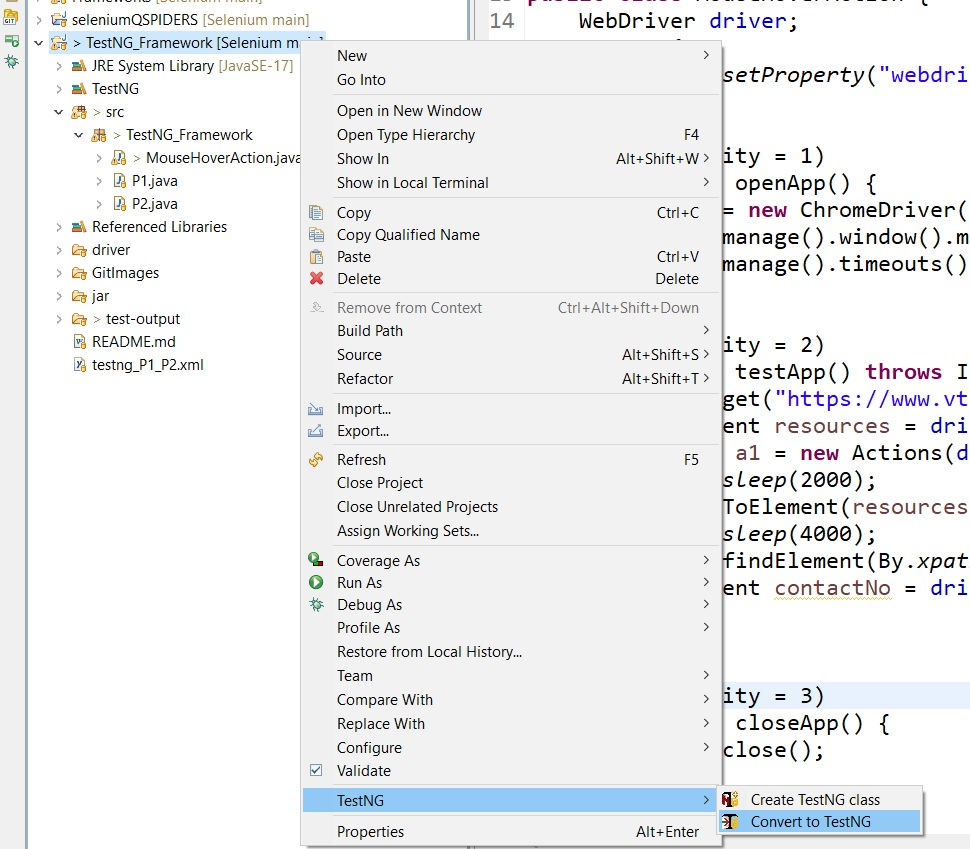

2. In Popup give desired name for xml file
    eg. TestNG1.xml

    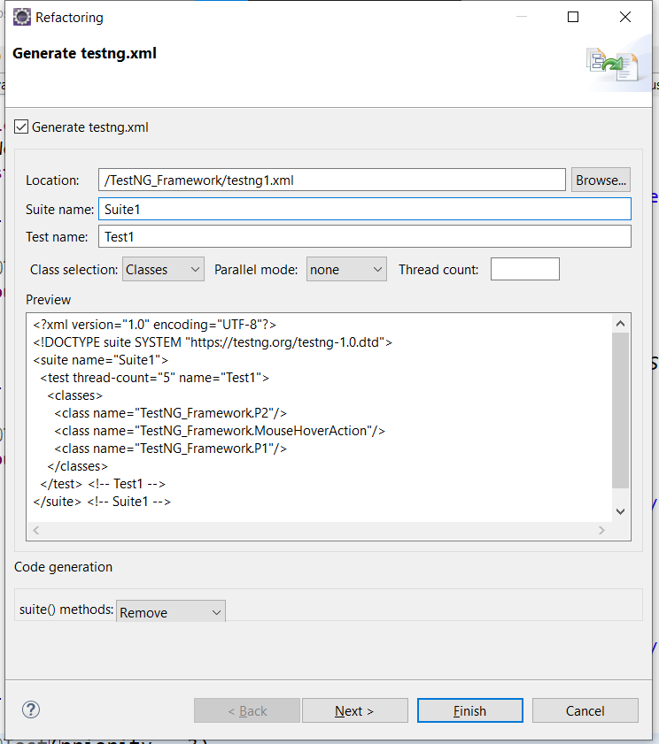

3. The testing1.xml file is shown below:

    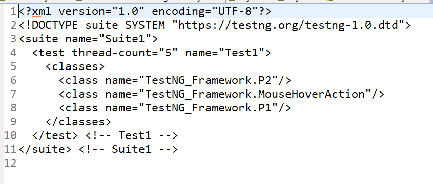

4. To run **TestSuite/xml file** 
    - Right click on xml file -> Run as -> Click on TestNG Suite.

    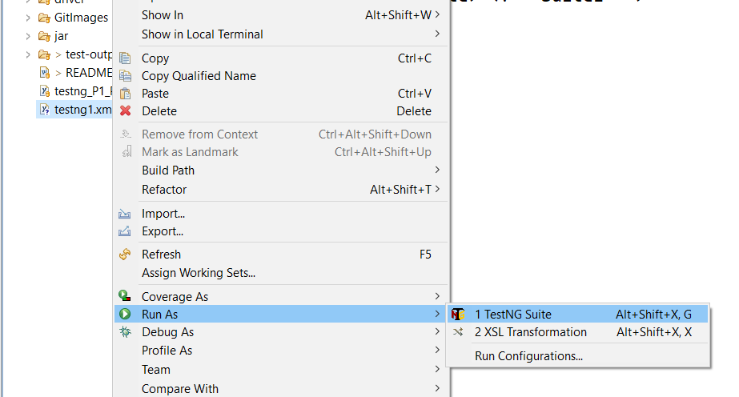

***************************
Program on **@BeforeMethod** and **@AfterMethod**

## P3

- **Scenario:-**

    Write a program using **@BeforeMethod** and **@AfterMethod** 

- **Source Code:-**

    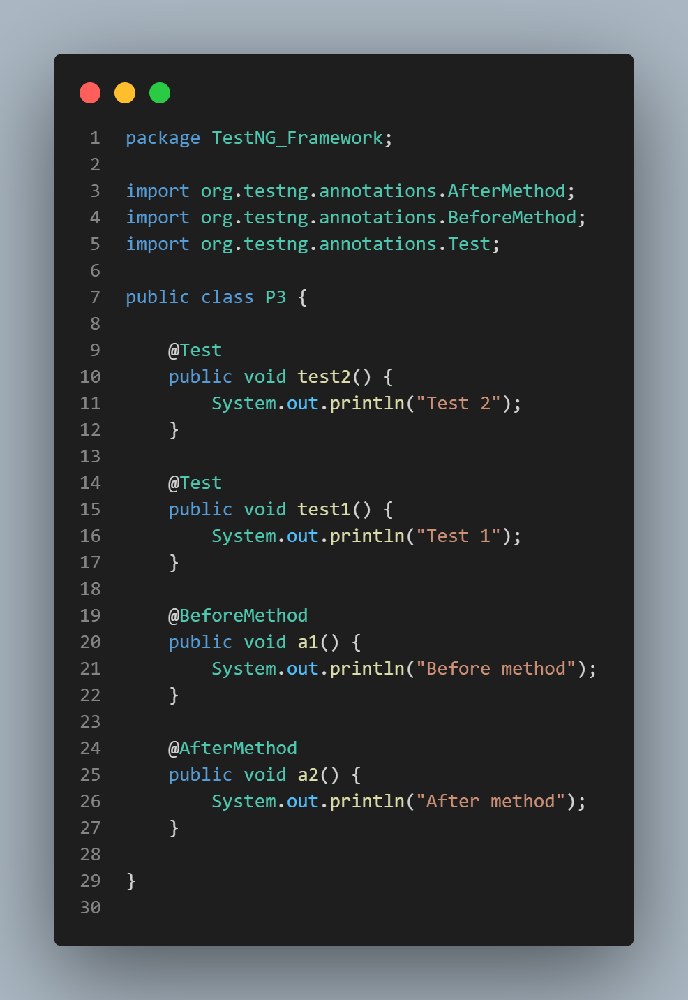

- **Console**

    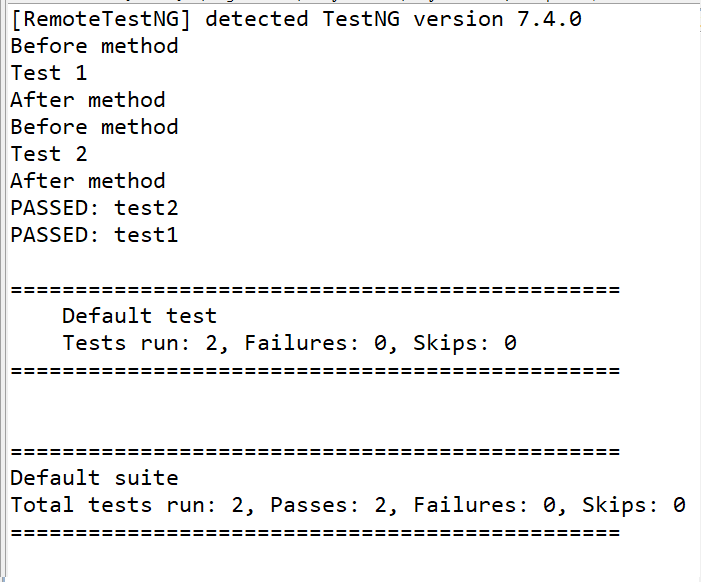

- **Explanation:-**

    1. We have created 2 **@Test** methods & 1 **@BeforeMethod** , **@AfterMethod** each.

    2. **@BeforeMethod** and **@AfterMethod** will execute each time for each **@Test** method.

************************

## P5

- **Scenario**
    1. Open browser
    2. Go to **google** -> print **title** -> print **current url**.
    3. Close browser
    4. Again Open browser
    2. Go to **Facebook** -> print **title** -> print **current url**.
    3. Close browser

************************

- **Source Code:-**

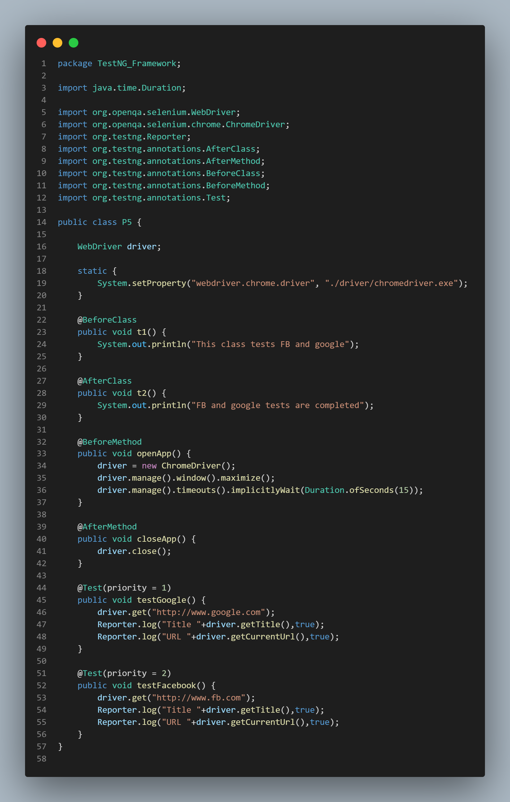

************************

- **Explanation:-**

1. Declared driver variable in global area So that we can use it in all methods.

    ```java
        WebDriver driver;
    ```

2. BeforeClass annotated method will execute one time **before** each class
    ```java
        @BeforeClass
        public void t1() {
            System.out.println("This class tests FB and google");
        }
    ```
3. AfterClass annotated method will execute one time **after** each class
    ```java
        public void t2() {
            System.out.println("FB and google tests are completed");
        }
    ```

4. Here BeforeMethod annotated method will open browser -> maximize window -> implicitly Wait for 15 seconds

    ```java
        @BeforeMethod
        public void openApp() {
            driver = new ChromeDriver();
            driver.manage().window().maximize();
            driver.manage().timeouts().implicitlyWait(Duration.ofSeconds(15));
        }
    ```

5. Here AfterMethod annotated method will close browser.
    ```java
        @AfterMethod
        public void closeApp() {
            driver.close();
        }
    ```

6. Here first **@Test** annotated method will Go to **google** -> print **title** -> print **current url**.
priority is given as **1** so it will execute first before all Test annotated method.

    ```java
        @Test(priority = 1)
        public void testGoogle() {
            driver.get("http://www.google.com");
            Reporter.log("Title "+driver.getTitle(),true);
            Reporter.log("URL "+driver.getCurrentUrl(),true);
        }
    ```
7. Here **second** Test annotated method will Go to **facebook** -> print **title** -> print **current url**.
priority is given as **2** so it will execute on second priority.

    ```java
        @Test(priority = 2)
        public void testGoogle() {
            driver.get("http://www.fb.com");
            Reporter.log("Title "+driver.getTitle(),true);
            Reporter.log("URL "+driver.getCurrentUrl(),true);
        }
    ```
************************

- **Console**

    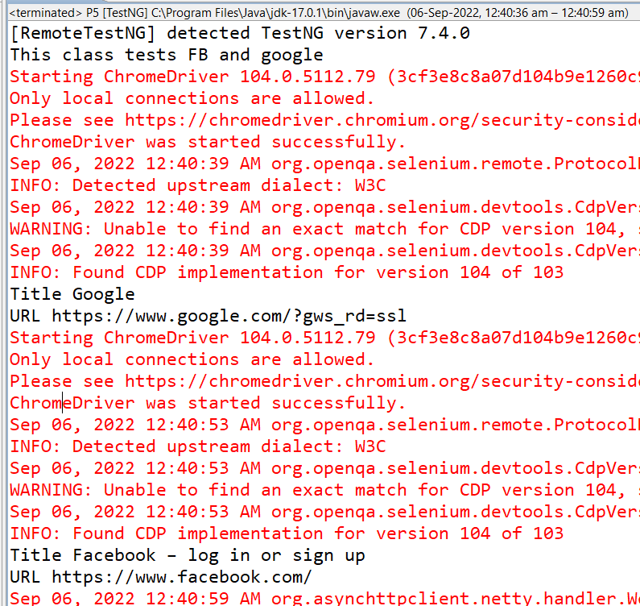
    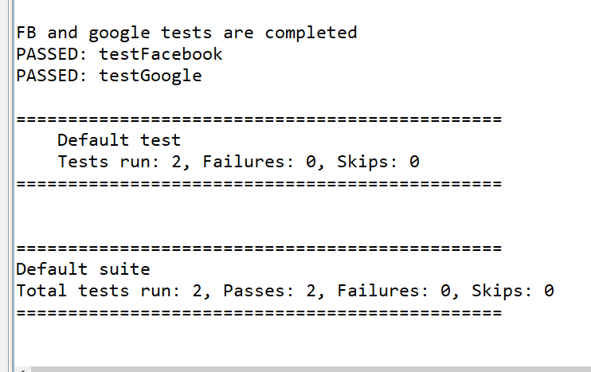
************************

- **Report.html**

    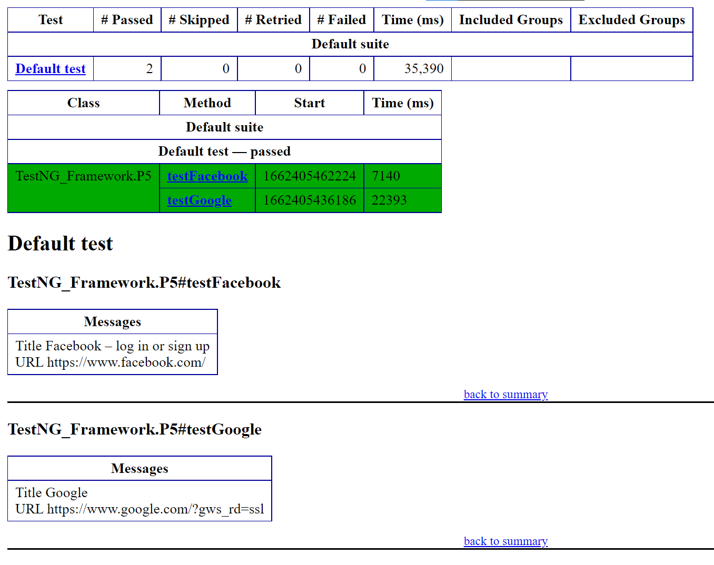

************************

# Assertion 

- Actual result is compared with expected result with the help of Assertion.
- It means verification is done to check if the state of the application is the same to what we are expecting or not.
- There are two types of Assertion:-
    1. Hard Assertions.
    2. Soft assertions.
- These are explained as following below. 
1. Hard Assertions : 
- If Hard Assertions is getting failed -> **Immediatly** test case will be marked as **failed** and test case will be **terminated**.

2. Soft Assertions : 
- If Soft Assertions is getting failed -> Soft Assert collects errors during @Test. Soft Assert **does not throw an exception** when an assert fails and would **continue** with the next step after the assert statement.


****************************************


# P6


- **Scenario**

    1. Open browser
    2. Go to **www.google.com** -> fetch the **title** -> Check if title is "facebook"
    3. Print "The End". 
    4. Close the driver.

- **Source Code:-**

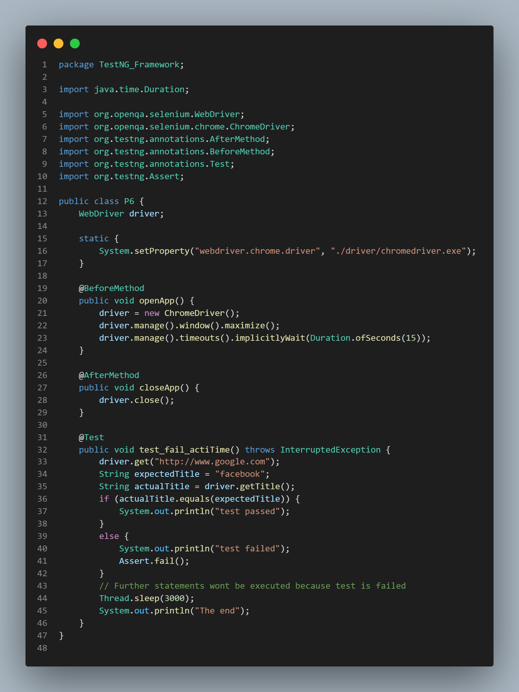

- **Explanation:-**

1. Declared driver variable in global area So that we can use it in all methods.

    ```java
        WebDriver driver;
    ```
2. Here BeforeMethod annotated method will open browser -> maximize window -> implicitly Wait for 15 seconds

    ```java
        @BeforeMethod
        public void openApp() {
            driver = new ChromeDriver();
            driver.manage().window().maximize();
            driver.manage().timeouts().implicitlyWait(Duration.ofSeconds(15));
        }
    ```

3. Here AfterMethod annotated method will close browser.
    ```java
        @AfterMethod
        public void closeApp() {
            driver.close();
        }
    ```
4. Here first **@Test** annotated method will Go to **google** -> Fetch **title** and store it in a variable 

    ```java
        driver.get("http://www.google.com");
        String actualTitle = driver.getTitle();
    ```

5. Store **"facebook"** in a variable.

    ```java
        String expectedTitle = "facebook";
    ```

6. Check if actual title is same as expected title.
    1. If expected title is same as actual title -> Test passed
    2. If expected title is not same as actual title -> Test Failed
```java
    if (actualTitle.equals(expectedTitle)) {
        System.out.println("test passed");
	} 
	else {
        System.out.println("test failed");
        Assert.fail();
    }
```

**************************

- **Console**

    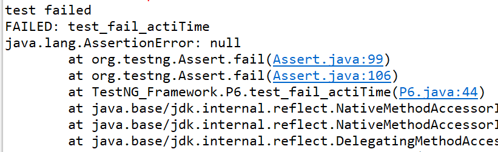

- **Report.html**

    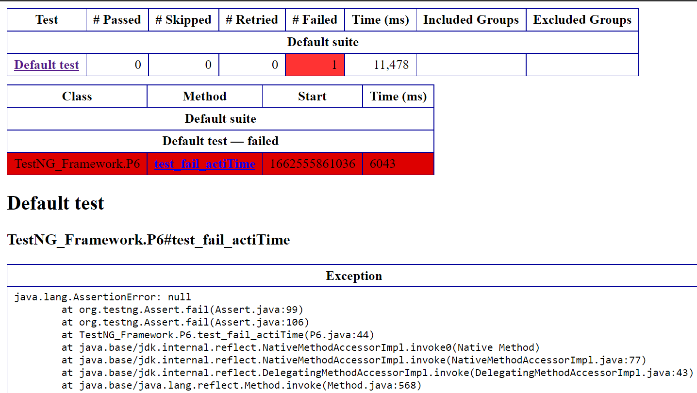


********************************

# P7

- **Scenario**

    1. Open browser
    2. Go to **www.google.com** -> fetch the **title** -> Check if title is "facebook"
    3. Print "The End". 
    4. Close the driver.

- **Source Code:-**
    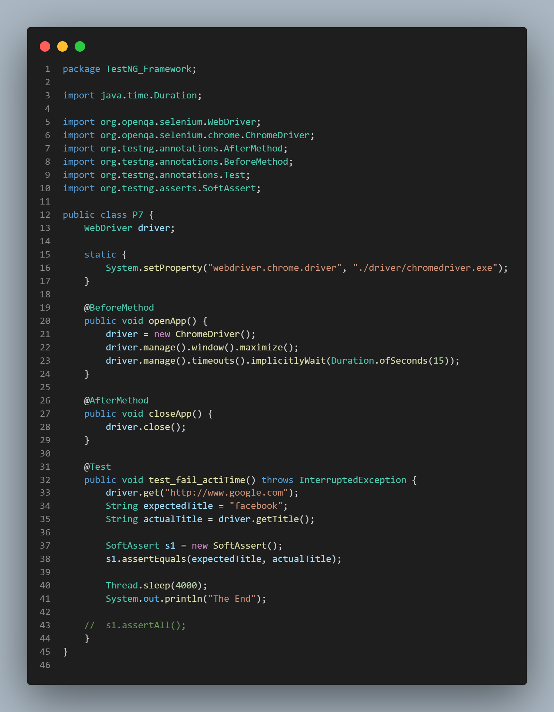

- **Explanation:-**

1. Declared driver variable in global area So that we can use it in all methods.

    ```java
        WebDriver driver;
    ```
2. Here BeforeMethod annotated method will open browser -> maximize window -> implicitly Wait for 15 seconds

    ```java
        @BeforeMethod
        public void openApp() {
            driver = new ChromeDriver();
            driver.manage().window().maximize();
            driver.manage().timeouts().implicitlyWait(Duration.ofSeconds(15));
        }
    ```

3. Here AfterMethod annotated method will close browser.
    ```java
        @AfterMethod
        public void closeApp() {
            driver.close();
        }
    ```

4. Here first **@Test** annotated method will Go to **google** -> Fetch **title** and store it in a variable 

    ```java
        driver.get("http://www.google.com");
        String actualTitle = driver.getTitle();
    ```

5. Store **"facebook"** in a variable.

    ```java
        String expectedTitle = "facebook";
    ```

6. Check if actual title is same as expected title.
    1. If **`expectedTitle`** **is not equal to** **`actualTitle`** The **SoftAssert** will skip this line and continue with next line.
    2. At the end all next lines will executed and **test will get passed**.


    ```java
        SoftAssert s1 = new SoftAssert();
        s1.assertEquals(expectedTitle, actualTitle);
    ```
7. Although **`expectedTitle`** **is not equal to** **`actualTitle`** **Test is passed**. To overcome this problem we will use **`assertAll()`**

    ```java
        s1.assertAll();
    ```
- **Console**
    - Without using **`assertAll()`**
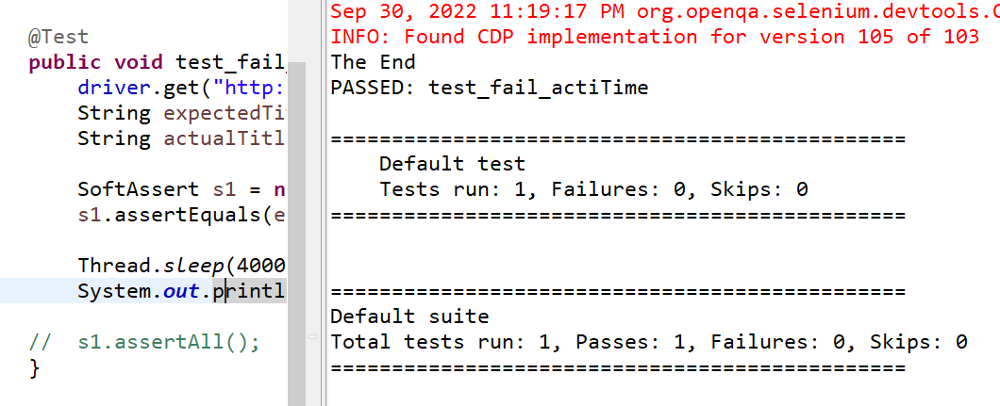

- **Console**
    - With **`assertAll()`**
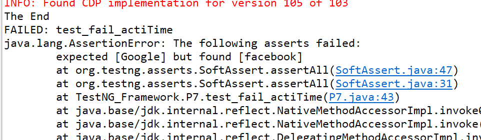

- **Report.html**
    - With **`assertAll()`**
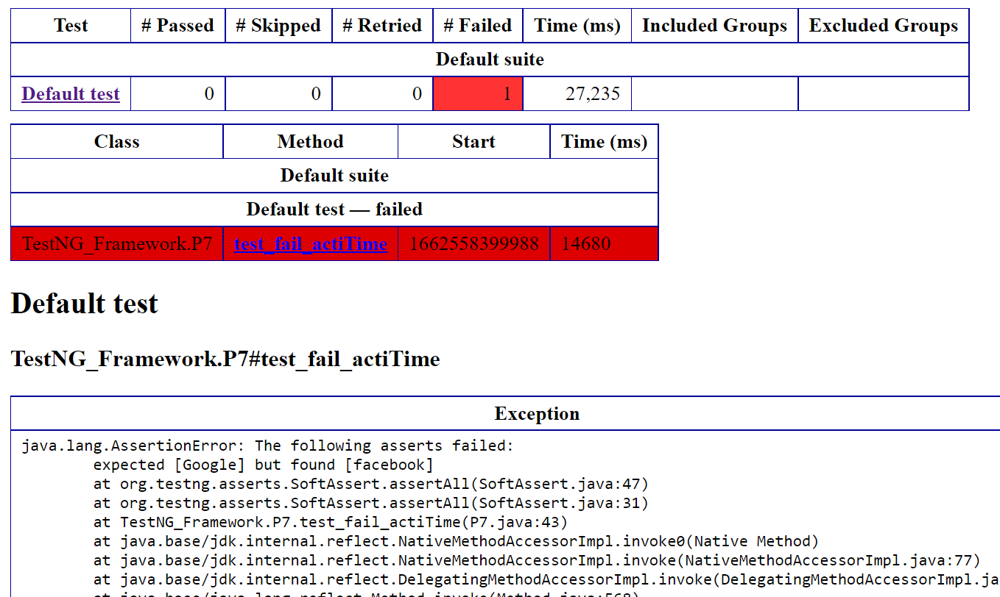


***********************
[GoBackToTop](#testng)