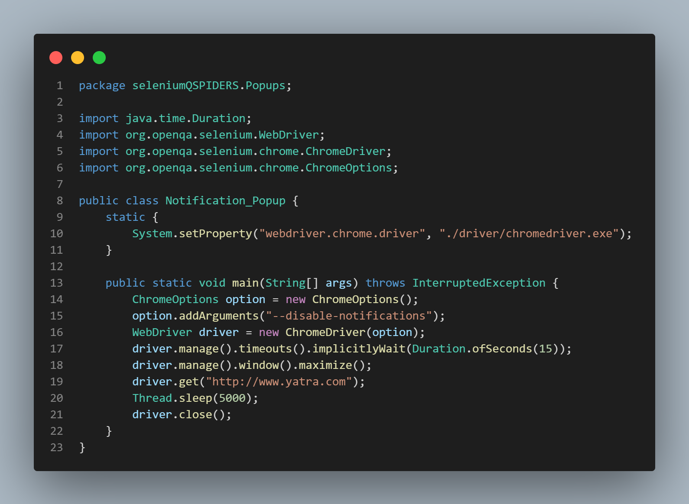

# Popups

## Types of popups

1.  [JavaScript_Popup](#JavaScript_Popup)
2.  [Hidden_Divison_Popup](#Hidden_Divison_Popup)
3.  [Child_Browser_Popup](#Child_Browser_Popup)
4.  [Notification_Popup](#Notification_Popup)
5.  [File_Upload_Popup](#File_Upload_Popup)
6.  [File_Download_Popup](#File_Download_Popup)
7.  [Print_Popup](#Print_Popup)


********************************************************************************
# JavaScript_Popup

- JavaScript Popup ia also called as **Alert Popups ,Confirmation Popups**.
- Characteristics
    1. We cannot inspect this popup.
    2. We cannot move this popup.
    3. This popup is located exactly below the address bar and in center of the page.
    4. It contains `OK` button(Alert) OR `OK` and `Cancel` button(Confirm). 
    
- There are 4 ways to handle JavaScript Popup:-

    1.  **dismiss():-** To click on the **'Cancel'** button of the alert.
    ```java
        driver.switchTo().alert().dismiss();
    ```

    2.  **accept():-** To click on the **'OK'** button of the alert.
    ```java
        driver.switchTo().alert().accept();
    ```

    3.  **getText():-** To fetch text from the popup.
    ```java
        driver.switchTo().alert().getText();
    ```

    4.  **sendKeys(String stringToSend) :-** To send some data to alert box.
    ```java
        driver.switchTo().alert().sendKeys("Text");
    ```
- Example:- (actiTime)


**************************************************************

# Hidden_Divison_Popup

- Characteristics:-
    1. We can inspect this pop-up.
    2. We can not move the pop-up.

- Solution:-
    1. We can handle this pop-up using `findElement()` itself.
    2. **Calender pop-up** is best example of **Hidden division pop-up**.

- Example 1:-(Flipkart)


- Example 2:-(Relience insurance)

    - Scenario
        1. Open the browser.
        2. Go to renew page of reliance Health Insurance `https://www.careinsurance.com/rhicl/proposalcp/renew/index-care`
        3. Enter policy number
        4. Select date of birth(15 mar 2002).
        5. Specify the **contact number** and click on **renew**.


**************************************************************
# Child_Browser_Popup
- Characteristics
    1. We can inspect this pop-up.
    2. We can move this pop-up.
    3. It will have minimize and maximize button

- Solution:-
    - We can handle this using **getWindowHandle()** ,**getWindowHandles()** and **switchTo()** 
**************************************************************
# Notification_Popup
- Characteristics
    1. We can not inspect this pop-up.
    2. We can not move this pop-up.
    3. This popup is licated exatly **below the address bar** & **towards left hand side**.
    4. The popup contains `allow` button & `block` button.

- Solution:-
    1. We can handle this pop-up by changing the settings in browser.
    2. we need to create an object for chromeoptions class.
    3. Using its refrence variable, we call `addArguments();`. We pass the command **`--disable-notifications`**.
    4. While opening the browser pass the chromeoptions refrence variable as an argument inside the chromedriver constructor.

- Syntax:-
```java
    ChromeOptions option = new ChromeOptions();
	option.addArguments("--disable-notifications");
	WebDriver driver = new ChromeDriver(option);
```

- Example:-


**************************************************************
# File_Upload_Popup
- Characteristics:-
    1. We can not inspect this pop-up.
    2. We can move this pop-up.
    3. This pop-up contains `open` button and `cancel` button. 

- Solution:-
    1. To handle this pop-up, the file to be uploaded must be present inside the java project.
    2. We need to create an object for **file** class and pass the path of the uploading file as an argument.
    3. We fetch the absolute path of the file & do **sendKeys()** directly on button. 
**************************************************************
# File_Download_Popup


**************************************************************
# Print_Popup

**************************************************************


[GoBack](https://github.com/NinadKarlekar/Selenium/blob/4316f057532f7bd3089d4e841319c5ce03f9b83d/README.md)